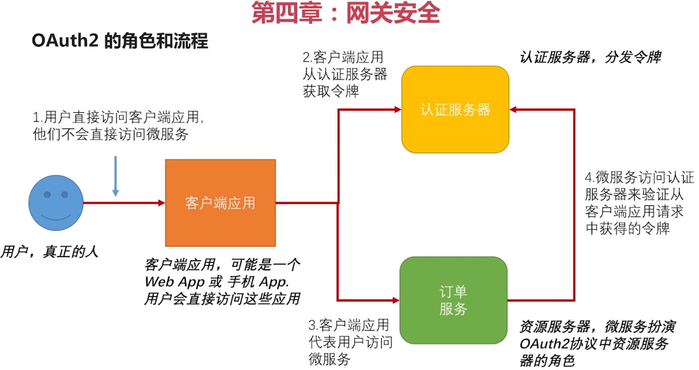
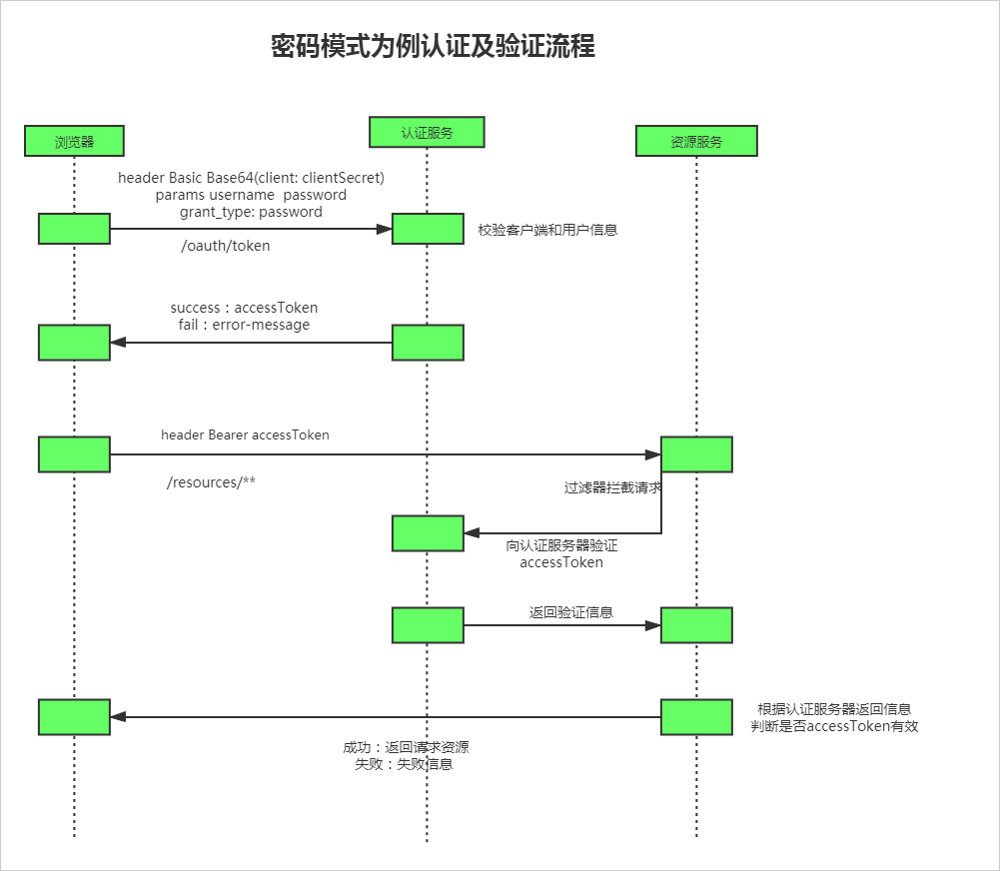
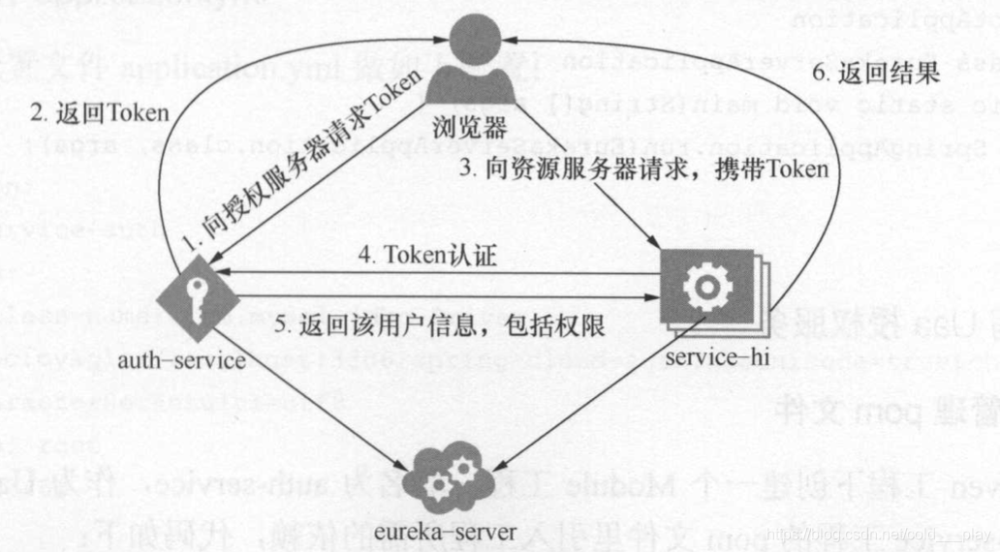

# 参考文章

Auth2角色和流程
https://www.cnblogs.com/lihaoyang/p/12045480.html

资源服务器深度讲解：
https://blog.csdn.net/m0_37834471/article/details/81814233

https://blog.csdn.net/q438944209/article/details/82920461

https://blog.csdn.net/w1054993544/article/details/109361170

https://segmentfault.com/a/1190000023662197?utm_source=tag-newest

URL拦截讲解：
https://blog.csdn.net/l984411392/article/details/103276173

# Auth2流程

---

---

---

## 用户信息验证
    
    可以参考：AuthenticationManager--->OAuth2AuthenticationManager

## Token信息验证

    可以参考：

    * AuthorizationServerTokenServices
                --->DefaultTokenServices//授权服务
    * ResourceServerTokenServices
                --->DefaultTokenServices//直接验证
                --->RemoteTokenServices//远程TokenInfo
                --->UserInfoTokenServices//远程userInfo

# Auth2介绍

Spring OAuth2是基于security来实现的。

Spring OAuth2分为两部分：OAuth2 Provider和OAuth2 Client。

OAuth2 Provider分为授权服务和资源服务：

* 客户端

    * 前端App，代替用户进行访问资源
    * 手机
    * Pad
    
    客户端是需要访问资源服务的，首先要申请token然后带着token令牌进行资源访问

* 授权服务

    * 用户认证服务
        
        验证用户登录，角色，权限等
        
    * 客户端认证服务
    
        验证各个服务模块的token等

* 资源服务

    * 资源服务端
    
        微服务本身属于资源服务提供方，称为资源服务端，本身的api被auth2保护起来
    
    * 资源客户端
    
        微服务还要调用其他微服务，也可以称为资源客户端

这两个角色可以在一个服务中，也可以不在一个服务中，也可能是一个授权服务，对应多个资源服务。

#认证中心

本服务为认证中心，其他微服务需要来次进行验证才可以通行

## Auth2的四种授权模式

* 授权码模式（authorization code）

    ~~~
        1.用户访问客户端，客户端通过用户代理向认证服务器请求授权码；
        2.用户同意授权；
        3.认证服务器通过用户代理返回授权码给客户端；
        4.客户端携带授权码向认证服务器请求访问令牌（AccessToken）；
        5.认证服务器返回访问令牌；
        6.客户端携带访问令牌向资源服务器请求资源；
        7.资源服务器返回资源。
    ~~~
  
* 简化模式（implicit）

    ~~~
        1.用户访问客户端，客户端通过用户代理向认证服务器请求授权码；
        2。用户同意授权；
        3.认证服务器返回一个重定向地址，该地址的url的Hash部分包含了令牌；
        4.用户代理向资源服务器发送请求，其中不带令牌信息；
        5.资源服务器返回一个网页，其中包含的脚本可以获取Hash中的令牌；
        6.用户代理执行脚本提取令牌；
        7.用户代理将令牌返回给客户端；
        8.客户端携带令牌向资源服务器请求资源；
        9.资源服务器返回资源。
    ~~~

* 客户端模式（client credentials）
    
    ~~~
        1.客户端向认证服务器进行身份认证，并要求一个访问令牌；
        2.认证服务器确认无误后，向客户端提供访问令牌；
        3.客户端携带令牌向资源服务器请求访问资源；
        4.资源服务器返回资源。
    ~~~
  
  常用于访问公共资源（无需登录）：网站首页
  
    ~~~
        请求参数：
        {
            grant_type:client_credentials  
            client_id:46582ae7217343a8b252e3977e7cc421  
            client_secret:cgGvf5Rotv7D76m9JaArfY3YG6fDec47  
        }
    ~~~
  
* 密码模式（resource owner password credentials）

    ~~~
        1.用户向客户端提供用户名密码；
        2.客户端将用户名和密码发给认证服务器请求令牌；
        3.认证服务器确认无误后，向客户端提供访问令牌；
        4.客户端携带令牌向资源服务器请求访问资源；
        5.资源服务器返回资源。
    ~~~
  
   常用于访问个人资源
 
     ~~~
        请求参数
        获取令牌：
        {
             grant_type:password
             client_id:46582ae7217343a8b252e3977e7cc421
             username:18565783136
             password:AC1DAdo9ZcY4dKAdtyPRzoICWZlkR7WDgtO06S5fVCUS6A/67rMxeW+2mKKbo2N1FQ==
             client_secret:cgGvf5Rotv7D76m9JaArfY3YG6fDec47
        } 
        刷新令牌：
        {
            grant_type:refresh_token
            client_id:46582ae7217343a8b252e3977e7cc421
            client_secret:cgGvf5Rotv7D76m9JaArfY3YG6fDec47
            refresh_token:1ba402f7-394b-420b-9805-39578d6176f8
        }
     ~~~

# 资源服务

其他服务提供方的微服务称为资源服务，例如：用户服务，订单服务，消息服务等

# HttpSecurity拦截URL

WebSecurity和ResourceServer中都有HttpSecurity的配置对URL进行拦截
但是会出现ResourceServer单独生效的效果

原因：

@Order(3)
ResourceServer
@Order(100)
WebSecurity

ResourceServer优先级更高,所以拦截规则会先匹配到资源配置，后面的就默认不执行了

* 在spring security里一个请只会被一个filter chain进行处理，也就是spring security通过遍历filterChains这个集合时，只要找到能处理该请求的filter chain就不再进行其他的filter chain匹配。
* ResourceServerConfigurerAdapter会把的http配置信息完全被覆盖掉，最后形成了，所有的请求只会在ResourceServerConfigurerAdapter的fitler chain中处理，导致用户不知道这两者到底是怎么回事。

/api/**会被ResourceServerConfigurer拦截
/user/**会被WebSecurityConfigurer拦截

http.antMatcher是要匹配哪个路径，其他的不管交给其他拦截器处理

### 案例
requestMatchers().anyRequest()
等同于
http.authorizeRequests().anyRequest().access("permitAll")

//只允许路由由test开头的需要进行权限认证，其他的接口不需要权限认证；requestMatchers().anyRequest()即所有接口可以不进行认证；	
	http
        .requestMatchers()
            .anyRequest()
        .and()
            .authorizeRequests()
                .antMatchers("/test/*").authenticated();
	
//只有以/test 开头的路由需要进行权限认证；其他路由不需要权限认证
	http
	    .requestMatchers()
	        .antMatchers("/test/**")
        .and()
            .authorizeRequests()
                .antMatchers("/**")
                    .authenticated();	
                    
//所有接口都不需要权限认证
http.authorizeRequests().antMatchers("/**").permitAll();
//所有接口都要进行权限认证
http.authorizeRequests().antMatchers("/**").authenticated();
//只有以test开头的接口需要进行权限认证
http.authorizeRequests().antMatchers("/test/**").authenticated();  

总结：如果想要各种拦截器同时起作用那么只需要配置自己管理的URL即可

配置效果：只会匹配/user/**，其中/user/user1可以访问其他需要授权
http
    .and()
         .requestMatchers()
               .antMatchers("/user/**")//匹配需要拦截的地址
     .and()
          .authorizeRequests()//需要授权的访问地址
                .antMatchers("/user/user1").permitAll()//user1可以访问
                .antMatchers("/user/user2").authenticated()//user2需要授权
                //如果下面不配置则其他可以随意访问
                .and()
                    .authorizeRequests()
                        .anyRequest().authenticated();//user/**下面的都要授权                  